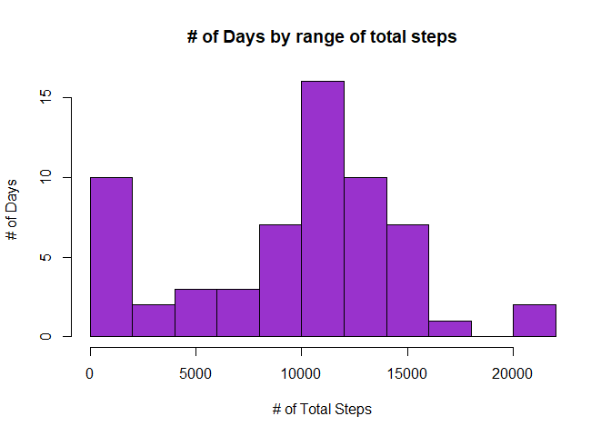
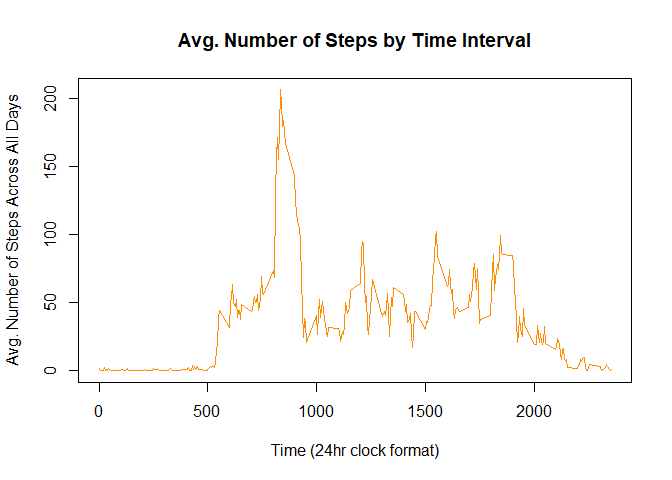
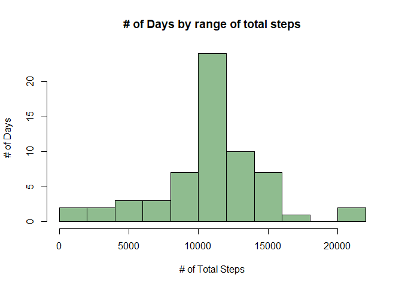

## Loading and preprocessing the data

Our first step is to read in the data. We're assuming that you've already downloaded the zipped folder from the course website and have moved the "activity.csv" file into your working directory. We'll store the data in an object called "activ" using read.csv. We'll do some data processing as we go for certain questions, but otherwise we really don't need to do any other pre-processing at this time.


```r
activ<-read.csv("activity.csv")
```

## What is the mean total number of steps taken per day?

To answer this, we use tapply to take the total number of steps for each date group (i.e., each day) and store the result in an object called dailysteps. We also include na.rm=TRUE to ignore the missing entries. To make the histogram a little more orderly, we break it into groups of 2000 steps at a time over a range that spans the entire data.  


```r
dailysteps<-with(activ,tapply(steps,date,sum,na.rm=TRUE))
every2k<-seq(from=0,to=22000,by=2000)
hist(dailysteps,breaks=every2k,col="darkorchid",main="# of Days by range of total steps",xlab="# of Total Steps",ylab="# of Days")
```

<!-- -->

We then explicltly compute the median and mean of dailysteps.


```r
median(dailysteps)
```

```
## [1] 10395
```

```r
mean(dailysteps)
```

```
## [1] 9354.23
```

## What is the average daily activity pattern?

We take a very similar step to the previous section, except this time we use tapply to group by interval insteady of date, and we use the mean function instead of sum. The result is stored in an object called intervsteps. Once again we ignore the missing values.

We want the labels (i.e., the interval time) of intervsteps as well the steps values, so we can retrieve them using names(intervsteps) and convert them to a useful format using as.numeric.


```r
intervsteps<-with(activ,tapply(steps,interval,mean,na.rm=TRUE))
plot(as.numeric(names(intervsteps)),intervsteps,type="l",col="darkorange",main="Avg. Number of Steps by Time Interval",xlab="Time (24hr clock format)",ylab="Avg. Number of Steps Across All Days")
```

<!-- -->

Now we want the interval time with the greatest value for average steps taken across all days. If we just wanted the step value at that time we could just use max(intervsteps), but since we also want the time associated with that maximum we can just subset the intervsteps object at its maximum to retrieve both the time and the number of steps. We see that the peak activity interval is 0835, which might correspond to a typical morning commute.


```r
intervsteps[intervsteps==max(intervsteps)]
```

```
##      835 
## 206.1698
```

## Imputing missing values

First let's check how many rows have missing values.We'll just use is.na for the entire activ data frame and, since it returns a bunch of TRUE/FALSE results where the TRUEs are equivalent to 1, we'll just sum them up. NOTE: steps is the only column that has NA values, so there is no row with more than one NA value and this approach works. This was verified by first running sum(is.na(activ$date)) and sum(is.na(activ$interval)), although those exploratory calculations are not shown here.


```r
sum(is.na(activ))
```

```
## [1] 2304
```

To avoid corrupting our original data with the NA values, we'll copy the entire activ data frame over to a duplicate frame, activ2. To replace the missing values, we will replace every missing value with the mean value associated with its time interval. To do this, we use a for loop that checks if a given element in activ2$steps is NA or not. 

A useful tool here is the %% operator, which is basically a "mod" or "remainder" operator that returns the remainder of the first number divided by the second number. E.g., 10%%3 would return 1, since 10 divided by 3 is 3 with 1 left over. This is useful because the interval value repeats every 288 values, so this lets us overcome the obstacle of activ2$steps being a different length than intervsteps$steps. One small patch we have to do is make separate if statements for the special case if j is an exact multiple of 288, since there is no "zero" index to pull from. In this special instance, we tell our for loop to explicltly pull the 288th value of intervsteps, which corresponds to interval 2355.


```r
activ2<-activ
for(j in 1:dim(activ2)[1]){
        if(is.na(activ2$steps[j]) & j%%288!=0){
                activ2$steps[j]<-intervsteps[j%%288]
        }
        if(is.na(activ2$steps[j]) & j%%288==0){
                activ2$steps[j]<-intervsteps[288]
        }
}
```

Now that we've populated the missing values with the interval-average values, we take basically the exact same steps we used in the first part of this assignment, i.e. use tapply with sum. We store the result in an object dailysteps2 to avoid overwriting the earlier object dailysteps. I kept na.rm=TRUE out of habit, although we don't really need it anymore since all the NA values were already replaced.

Now, we see that there are a lot fewer days with a total number of steps at or close to zero, and that there are more days that have something close to the earlier average number of steps (i.e., around 10000).


```r
dailysteps2<-with(activ2,tapply(steps,date,sum,na.rm=TRUE))
every2k<-seq(from=0,to=22000,by=2000)
hist(dailysteps2,breaks=every2k,col="darkseagreen",main="# of Days by range of total steps",xlab="# of Total Steps",ylab="# of Days")
```

<!-- -->

Finally, just like before, we re-calculate the median and mean. Both the mean and median have now increased, which we would expect since we've replaced values that would have tended towards zero with non-zero values. However, We also get the quirky result that the mean and median are identical. This is because there are eight entire days (10/1,10/8,11/1,11/4,11/9,11/10,11/14,11/30) that previously had entirely missing values that have now been replace only by the mean at each time interval. The median happens to fall among these eight days, so in this rare instance the median and mean being identical makes sense.


```r
median(dailysteps2)
```

```
## [1] 10766.19
```

```r
mean(dailysteps2)
```

```
## [1] 10766.19
```

## Are there differences in activity values between weekdays and weekends?

To begin, we create a new factor variable "daytype" in two steps. In the first we just add a new column by using the weekdays function, so now there a bunch of values Monday,Tuesday,...,Sunday in that column. Note that we have to convert the date column using as.Date(as.character()) before applying weekdays because the weekdays function does not play nicely with a factor variable.In the second step, we map our weekdays to our weekday/weekend factor levels using the factor function.


```r
activ2$daytype<-weekdays(as.Date(as.character(activ2$date)))
weekdays<-c("Monday","Tuesday","Wednesday","Thursday","Friday","Saturday","Sunday")
weektest<-c("Weekday","Weekday","Weekday","Weekday","Weekday","Weekend","Weekend")
activ2$daytype<-factor(activ2$daytype,levels=weekdays,labels=weektest)
```

Now we want to make a panel plot comparing weekday activity with weekend activity. We basically do the same steps as we did for the earlier line plot in this assignment, except we do it two times separately, once for the weekday data and once for the weekend data. This is done by subsetting on our new daytype column. We then proceed to use the tapply/mean combo that we used earlier. Once again, we don't really need the na.rm=TRUE bit since we've removed the NA values, but it wasn't doing any harm so I kept it in. We set up the panel plot with par and then call plot twice, one for the weekday data and one for the weekend data.

The data is noisy, but we can observe a couple of trends that make sense. During the weekdays, we see an early start time (just after 0500) and two peaks around 0830 and 1800, which might correspond to commute times. During the weekend, activities pick up considerably later (closer to 0800) and are more-or-less steady until the end of the day.


```r
activ2wkdy<-activ2[activ2$daytype=="Weekday",]
activ2wknd<-activ2[activ2$daytype=="Weekend",]
intervstepswkdy<-with(activ2wkdy,tapply(steps,interval,mean,na.rm=TRUE))
intervstepswknd<-with(activ2wknd,tapply(steps,interval,mean,na.rm=TRUE))
par(mfrow=c(2,1),mar=c(4,4,2,1))
plot(as.numeric(names(intervstepswkdy)),intervstepswkdy,type="l",col="red",main="Weekday Data",xlab="Time (24hr clock format)",ylab="Avg. # Steps Across All Days")
plot(as.numeric(names(intervstepswknd)),intervstepswknd,type="l",col="blue",main="Weekend Data",xlab="Time (24hr clock format)",ylab="Avg. # Steps Across All Days")
```

<!-- -->

## Thank you for reviewing and grading this assignment! Your time and attention is much appreciated. Stay safe out there!
